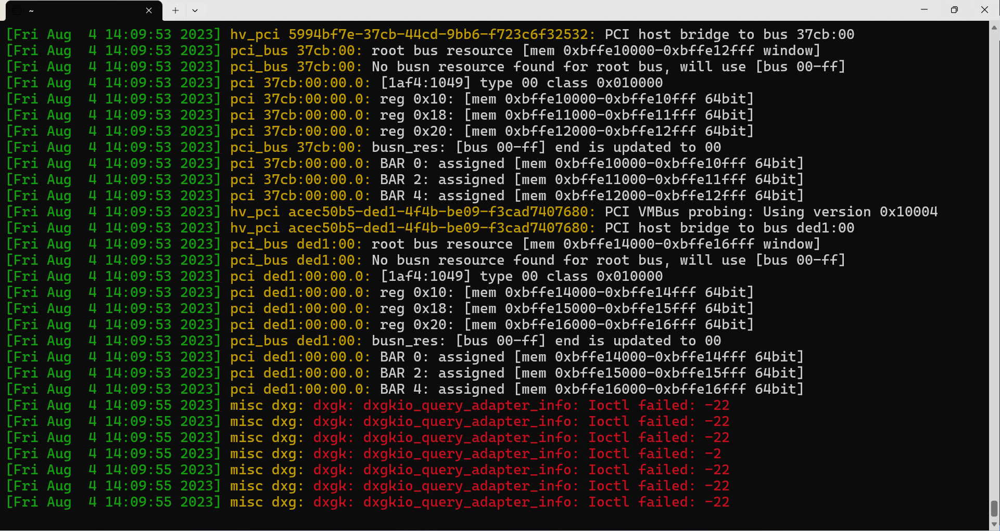

## theAcloud - Certified CompTIA Linux+  and Certified LPIC-1- System Administrator
### noted commands

    dmseg -T //gives the log output of the bootup in seconds by default the <-T> option will show the date 
    

